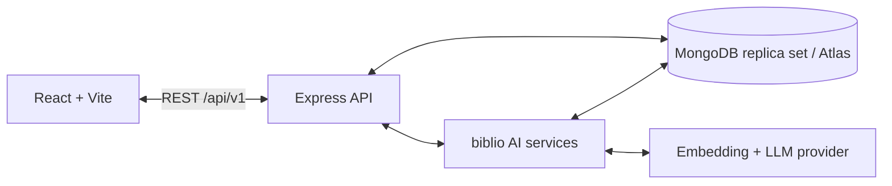

# biblio

<p align="center"></p>

**A university library platform for finding, borrowing, and learning from the resources already in your library.**

[](https://github.com/Suh7s/biblio/actions/workflows/ai.yml)

biblio brings catalogue search, borrowing, reservations, saved reading lists, and library analytics into one application. Its AI assistant, **biblio AI**, retrieves real library resources to explain search results, suggest reading directions, and build learning paths with source citations.

[Get started](#get-started) · [biblio AI](#biblio-ai) · [API](#api-overview) · [Testing](#testing) · [Documentation](#documentation)

## What you can do

| Area | Capabilities |
| --- | --- |
| **Discover** | Browse and search the catalogue, filter by category and availability, view book details, and save resources for later. |
| **Borrow** | Borrow, return, and renew books; see current loans, reading history, due dates, and overdue fines. |
| **Reserve** | Join the queue for an unavailable title, receive an in-app pickup notification, and collect a reserved copy. |
| **Learn with biblio AI** | Search by meaning, ask library questions, inspect cited excerpts, and create learning paths using actual Book IDs. |
| **Get recommendations** | Discover resources using interests, saved books, borrowing history, recent searches, and semantic similarity. |
| **Administer** | Create and edit catalogue records, manage inventory, and view users, borrowings, reservations, and analytics through admin APIs. |

The interface includes protected reader and admin pages, responsive layouts, and loading, empty, and error states. Admin user and borrowing screens currently provide read-only views.

## Architecture

| Layer | Technology |
| --- | --- |
| Frontend | React, Vite, React Router, Axios, Tailwind utilities and CSS |
| Backend | Node.js, Express, versioned REST APIs |
| Database | MongoDB, Mongoose, multi-document transactions |
| Authentication | JWTs in HTTP-only cookies, bcrypt, current-user role checks |
| Validation | Zod and centralized error handling |
| AI | Embeddings, Atlas Vector Search or bounded exact vector search, structured LLM source selection |
| Verification | Node test runner, isolated MongoDB replica sets, Playwright, Postman, GitHub Actions |



Books are stored once. Borrowings, reservations, saved lists, and AI chunks reference the canonical Book ID. Inventory and circulation changes commit together in transactions, including related fines and notifications.

## Get started

### 1. Prerequisites

- **Node.js 22+** and npm.
- **MongoDB Atlas or a local MongoDB replica set.** A standalone MongoDB instance cannot run the required transactions.
- An **OpenAI API key** to use live AI features. Auth, catalogue, circulation, and admin features can run without it.

### 2. Clone and install

```sh
git clone https://github.com/Suh7s/biblio.git
cd biblio
npm ci --prefix backend
npm ci --prefix frontend
```

### 3. Configure the environment

For a fresh checkout:

```sh
cp backend/.env.example backend/.env
cp frontend/.env.example frontend/.env
```

Edit `backend/.env` before starting the API:

Upgrading an existing installation? Keep your existing `MONGODB_URI`, database, and Docker volume. The biblio rebrand does not require a data migration.

| Variable | Local setup |
| --- | --- |
| `MONGODB_URI` | Your Atlas connection string, or `mongodb://127.0.0.1:27017/biblio?replicaSet=rs0` for the local setup below. |
| `JWT_SECRET` | Replace the placeholder with a unique random secret of at least 32 characters. |
| `CLIENT_ORIGIN` | `http://localhost:5173` |
| `PORT` | `5000` |
| `AI_VECTOR_MODE` | `exact` for a small local collection; `atlas` when using an Atlas vector index. |
| `OPENAI_API_KEY` | Your server-side key, if enabling live AI. |

Generate a JWT secret locally with `openssl rand -hex 32` and paste the result into `JWT_SECRET`.

The frontend example sets `VITE_API_URL=http://localhost:5000/api/v1`. Keep browser/API hostnames consistent, and keep provider keys and the JWT secret out of frontend variables. The [environment reference](docs/integration.md#4-required-environment-variables) lists every setting and default.

<details>
<summary>Run a local MongoDB replica set with Docker</summary>

If you are using Atlas, skip this step. With Docker running, create a local database:

```sh
docker run --name biblio-mongo -p 127.0.0.1:27017:27017 -v biblio-mongo-data:/data/db -d mongo:7 --replSet rs0 --bind_ip_all
```

Once MongoDB is accepting connections, initialize the replica set:

```sh
docker exec biblio-mongo mongosh --quiet --eval 'rs.initiate({_id:"rs0",members:[{_id:0,host:"127.0.0.1:27017"}]})'
```

This initialization is needed only once. For subsequent sessions, use `docker start biblio-mongo`.

</details>

### 4. Start the application

Run these commands from the repository root in **separate terminals**:

```sh
# Terminal 1 — API
npm run dev:api
```

```sh
# Terminal 2 — frontend
npm run dev:web
```

Open **[http://localhost:5173](http://localhost:5173)**. The API base URL is `http://localhost:5000/api/v1`.

### 5. Create your first administrator

Register an account through the UI. New accounts receive the `USER` role. Grant administrator access to that existing account using the trusted local CLI:

```sh
npm run admin:grant --prefix backend -- admin@example.edu
```

Use the registered email, then sign in again. Open `/admin/books` to add real library resources. A fresh database starts with an empty catalogue; the application does not seed invented books or AI answers.

## biblio AI

Try a question such as:

> “I know Python and calculus. What should I read to learn how robots perceive and navigate?”

biblio AI uses the library's descriptions and indexed excerpts to retrieve relevant resources. The LLM selects sources and verbatim excerpts; the server validates those selections and builds the answer from current catalogue records.

```text
Question → embedding → relevant BookChunks → source selection
         → citation verification → answer + current book cards
```

- **Semantic search** returns ranked resources, relevance explanations, and current catalogue metadata.
- **Grounded answers** include source attribution and clickable book cards. Unknown source IDs and unverifiable quotations are rejected.
- **Learning paths** organize retrieved resources into a suggested schedule of 1–52 weeks.
- **Insufficient context** produces an explicit response rather than filling gaps with books from model memory.

### Index your library

Add books and configure `OPENAI_API_KEY` first. In **Admin → Manage books**, choose **Index for AI** on each new or changed title to make its catalogue description available to search and reading guidance. For a bulk reindex, or to create the Atlas vector index, use the commands below:

```sh
# Atlas mode only — create the vector search index
npm run ai:create-vector-index --prefix backend

# Atlas or exact mode — embed existing catalogue records
npm run ai:index --prefix backend
```

In Atlas mode, wait for the index to become queryable before searching. Re-run catalogue indexing after changing searchable book metadata; inventory-only changes do not need new embeddings.

Catalogue descriptions are identified as descriptions. For chapter-level citations, an admin must import actual source excerpts using `PUT /api/v1/ai/books/:bookId/chunks`. See the [AI setup guide](docs/ai-setup.md) for the request format, model settings, index configuration, and source handling.

Learning paths are reading suggestions, not verified prerequisite curricula. Similarity scores indicate retrieval similarity, not answer confidence.

## Application routes

| Reader pages | Admin pages |
| --- | --- |
| `/register`, `/login`, `/profile` | `/admin` — overview |
| `/books`, `/books/:id` | `/admin/books` — catalogue management |
| `/my-library`, `/reservations`, `/fines` | `/admin/users` — reader accounts |
| `/saved-books` | `/admin/borrowings` — loan overview |
| `/ai` — assistant, search, paths, recommendations | `/admin/analytics` — demand and inventory trends |

Catalogue and library tools require sign-in. Backend authorization remains authoritative for every protected action.

## API overview

All endpoints use the `/api/v1` prefix.

| Area | Main endpoints |
| --- | --- |
| Authentication | `POST /auth/register`, `POST /auth/login`, `POST /auth/logout`, `GET /auth/me` |
| Profile and history | `GET/PATCH /users/me`, `GET /users/me/history` |
| Saved books | `GET /users/me/saved-books`, `PUT/DELETE /users/me/saved-books/:bookId` |
| Catalogue | `GET /books`, `GET /books/:id`, `GET /categories`; ADMIN-only book creation, updates, and deletion |
| Borrowing | `POST /borrow/:bookId`, `GET /borrow/my`, `PATCH /borrow/:id/return`, `PATCH /borrow/:id/renew` |
| Reservations | `POST /reservations/:bookId`, `GET /reservations/my`, `DELETE /reservations/:id` |
| Fines and notifications | `GET /fines/my`, `GET /notifications`, `PATCH /notifications/:id/read` |
| biblio AI | `GET /ai/search?q=`, `POST /ai/ask`, `POST /ai/learning-path`, `GET /ai/recommendations` |
| Administration | `GET /admin/dashboard`, `/admin/users`, `/admin/borrowings`, `/admin/reservations`, `/admin/analytics` |

Success responses use `{ "success": true, "message": "...", "data": {} }`. Errors use `{ "success": false, "message": "...", "errors": {} }`. Missing or invalid authentication returns **401**; insufficient permissions return **403**; circulation conflicts return **409**.

Login sets an HTTP-only cookie. Roles are read from the current user record, and logout revokes all sessions for that account. Bearer tokens from real login responses are also supported for API clients.

Use the [Postman endpoint collection](postman/biblio.postman_collection.json) for request bodies, query parameters, source management, and failure cases.

## Testing

From the repository root:

```sh
# Backend unit and real HTTP/database integration tests
npm test --prefix backend

# Production frontend build
npm run build --prefix frontend

# Browser checks
cd frontend
npx playwright install chromium
npm run test:ai
npm run test:integration
```

`test:ai` includes the AI and authentication UI regressions on desktop/mobile layouts. `test:integration` starts an isolated API and database and exercises the actual frontend/backend flow. The first backend test run downloads a MongoDB binary; the first browser setup downloads Chromium.

The [integration audit](docs/integration.md) records **52 backend tests, 22 UI regressions, one full browser/API scenario, and 56 Postman requests with 126 assertions**. CI runs backend tests, the frontend build, and both browser suites.

For a controlled, containerized production starting point, see the [department deployment guide](docs/deployment.md). Campus SSO, privacy/retention approval, a restore-tested backup, and an infrastructure security review remain launch requirements.

**AI testing boundary:** automated integration tests use real MongoDB and vector retrieval with deterministic provider responses. They do not establish live OpenAI quality or Atlas index readiness; those require a configured environment and representative library queries.

### Postman walkthrough

Import the [ordered integration collection](postman/biblio.integration.postman_collection.json), set its admin credentials and test-user passwords, and run against a disposable library:

1. **Core flows:** registration/login/logout, book CRUD, borrowing/returning, role checks, reservation handoff, and admin views.
2. **AI flows:** source import, semantic search, a cited answer, a learning path, and recommendations. Requires configured AI or the isolated test fixture.
3. **Cleanup:** remove the test book and its indexed sources.

The [runbook](docs/integration.md#6-final-postman-testing-sequence) includes the complete testing and demo sequences.

## Repository layout

```text
backend/
  src/
    controllers/      Request handling for each domain
    middleware/       Authentication, authorization, errors
    models/           Shared MongoDB schemas
    routes/           Versioned REST endpoints
    services/         Transactional circulation and AI services
  scripts/            Indexing, admin provisioning, data audit
  test/               AI and cross-module integration tests
frontend/
  src/                Reader, admin, auth, circulation, and AI UI
  tests/              Playwright regressions and integration flow
postman/              Endpoint reference and ordered test collection
docs/                 AI setup, contracts, and integration runbook
architecture.md       Shared architecture and ownership conventions
```

## Operational notes

- Default circulation rules are **14-day loans**, **two renewals**, **three-day pickup holds**, and **1 currency unit per overdue day**, assessed on return. All are configurable.
- Before using an existing database, run `npm run audit:data --prefix backend` to inspect inventory inconsistencies, duplicate active records, queue gaps, and missing book references. The audit is read-only.
- Production requires HTTPS, TLS MongoDB, a trusted proxy configuration, an exact `CLIENT_ORIGIN`, and same-site frontend/API hosting. Production AI requires an Atlas vector index and a server-side provider key. Rate-limit counters are in-process; scaling needs a shared store.
- Notifications are in-app. Password recovery, email verification, email/push delivery, fine settlement, and staff workflows for editing user/loan records remain future work. The admin book list currently shows up to 100 records.

## Contributing

See [CONTRIBUTING.md](CONTRIBUTING.md) for local checks, code boundaries, and pull request guidance. GitHub provides focused [bug report](.github/ISSUE_TEMPLATE/bug_report.yml), [feature request](.github/ISSUE_TEMPLATE/feature_request.yml), and pull request templates.

## Documentation

| Guide | Contents |
| --- | --- |
| [Shared architecture](architecture.md) | Models, module ownership, routes, and engineering conventions |
| [AI setup](docs/ai-setup.md) | Provider configuration, indexing, source import, and retrieval behavior |
| [AI integration contracts](docs/ai-contracts.md) | Shared Book/user/activity interfaces and AI response shapes |
| [Integration audit and runbook](docs/integration.md) | Fixes, environment reference, deployment checks, tests, and demo sequence |

For contributions, use a feature branch, follow the shared architecture, preserve canonical Book references and response contracts, and include checks appropriate to the change.
